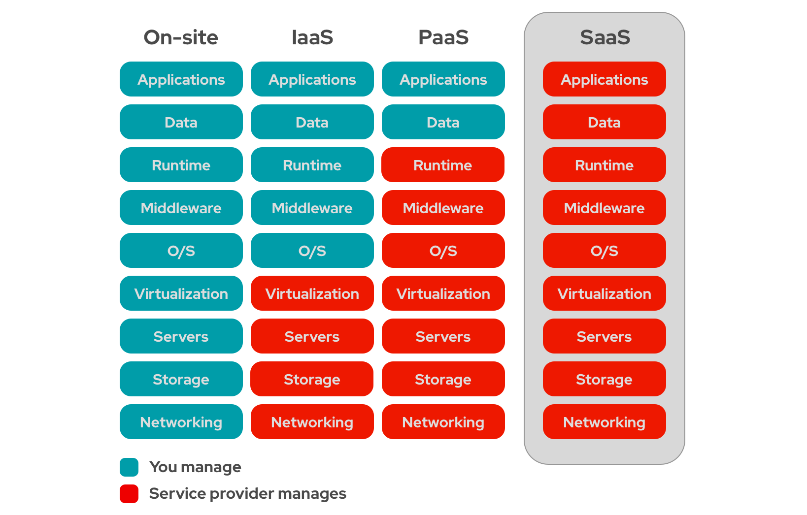

# as a Service

what can be delivered as a service, different stages for different goals.

## SAAS PAAS IAAS - RedHat

Software / Platform / Infrastructure as a Service
 
[https://www.redhat.com/en/topics/cloud-computing/what-is-saas](https://www.redhat.com/en/topics/cloud-computing/what-is-saas)

**Software-as-a-service** (SaaS) is a form of cloud computing that delivers a cloud application—and all its underlying IT infrastructure and platforms—to end users through an internet browser.
In addition to SaaS, other major as-a-Service options can include Infrastructure-as-a-Service (IaaS) and Platform-as-a-Service (PaaS).

## MaaS

**MaaS** is automated bare**m**etal provisioning

Solid introduction to Maas by Tim:
[https://www.youtube.com/watch?v=lEqD3mRcqSo](https://www.youtube.com/watch?v=lEqD3mRcqSo)
