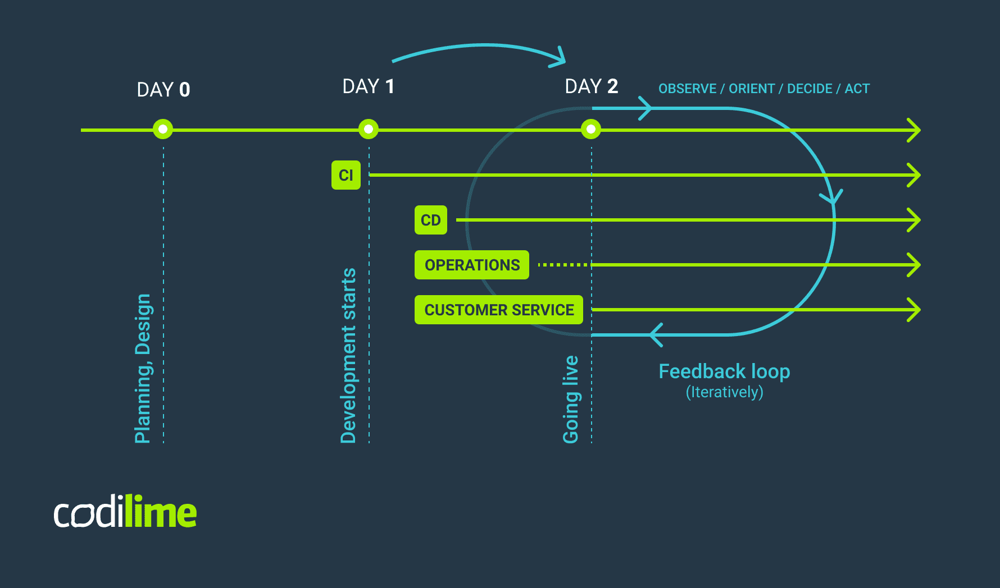

# Day 0 / Day 1 / Day 2 - lifecycle

Often referred to as **day * operations**, summs to:

* Day 0 - desing
* Day 1 - implementation
* Day 2 - golive and operation

Day 0 is the very first day of training, when recruits enter their formative stage. In software development, it represents the design phase, during which project requirements are specified, requirements engineering is conducted, and the architecture of the solution is decided.

Day 1 involves developing and deploying software that was designed in the Day 0 phase. In this phase we create not only the application itself, but also its infrastructure, network, external services and implement the initial configuration of it all.

Day 2 is the time when the product is shipped or made available to the customer. Here, most of the effort is focused on maintaining, monitoring and optimizing the system. Analyzing the behavior of the system and reacting correctly are of crucial importance, as the resulting feedback loop is applied until the end of the application’s life.

https://codilime.com/blog/day-0-day-1-day-2-the-software-lifecycle-in-the-cloud-age/

